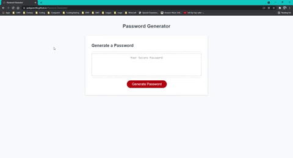
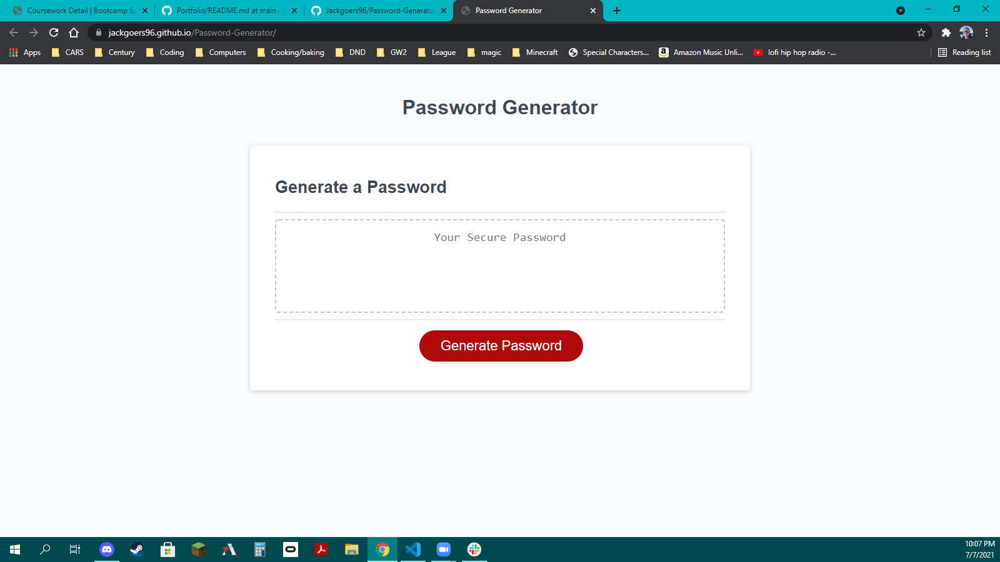

# Password Generator

## Description

​Password generator with up to 128 random characters for you to build a secure password!
​

## Installation

Follow the link to the page, select "generate" and follow the prompts as necessary. A password will be generated in the box. Simply copy and use where desired.
​

## Usage

​https://jackgoers96.github.io/Password-Generator/

​ 
 

## Credits

I thank Shawn MCWhorter and Alena Rehberger for their assitance in getting this one done and lending sections of their code to me for use/reference.
​
https://github.com/Rhandom1

https://github.com/AlenaReh
​

​
​

## License

​​
​

---

​
